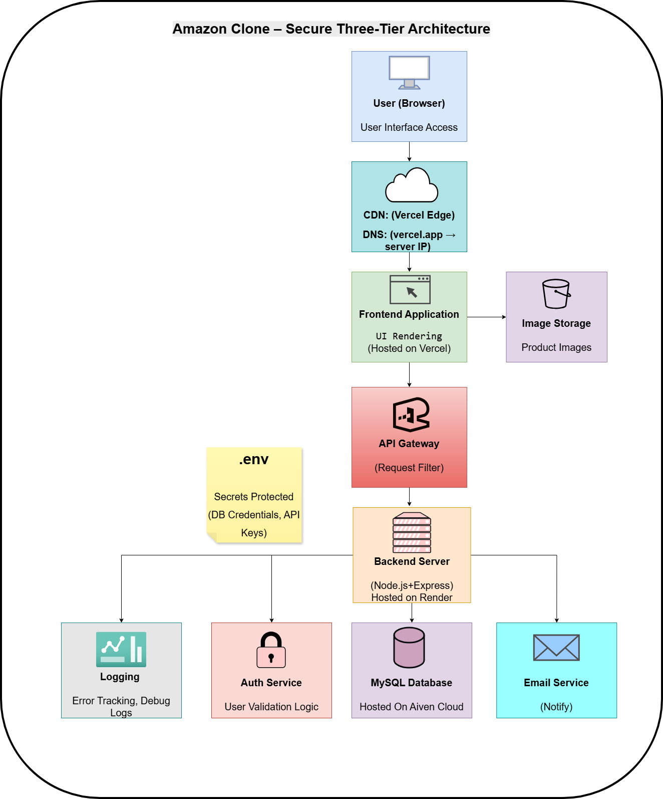
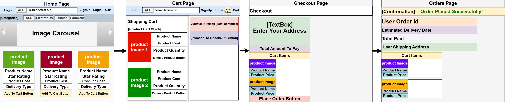

# Amazon Clone Fullstack Project
A full-stack e-commerce web app inspired by Amazon.
Users can browse products, add them to cart, and place orders.

  

## 🎨 User Workflow / UI Wireframe

  

### Live Demo
Frontend: https://amazon-clone-frontend-ridhi.vercel.app/
Backend: https://amazon-clone-backend-34ux.onrender.com

## 🚀 Deployment

The application is fully deployed and accessible online:

- Frontend deployed on Vercel  
- Backend deployed on Render  
- Database hosted on Aiven Cloud (MySQL)

## Setup

### Clone Repository
git clone https://github.com/CoderRidhi/amazon-clone.git
cd amazon-clone

### Backend Setup

cd backend
npm install 

### Create a .env file:
PORT=5000
DB_HOST=your_host
DB_USER=your_user
DB_PASSWORD=your_password
DB_NAME=your_database

### Run Backend
node server.js

### Frontend
cd frontend
npm install
npm start

### Database
Create a MySQL database
Import schema.sql
Update database credentials in .env

## 📂 Project Structure

The project is organized into separate layers following a clean architecture:

/amazon-clone  
├── frontend/        # UI layer (React)  
├── backend/         # API & business logic (Express)  
├── database/        # Schema and SQL scripts  
└── README.md

## Features

* User Signup and Login (Authentication)
* Browse all products
* Search and filter products by category
* View product details
* Add/remove items from cart
* Update quantity in cart
* Place order with address
* Order confirmation email 
* Responsive user interface

---

## Tech Stack

**Frontend (Presentation Layer):**
- React.js
- Axios
- Context API

**Backend (Application Layer):**
- Node.js
- Express.js

**Database (Data Layer):**
- MySQL

**Other Tools & Libraries:**
- Nodemailer (Email Service)
- CORS
- dotenv (Environment Variables)

## Three-Tier Architecture

This project follows a **Three-Tier Architecture**, ensuring scalability, maintainability, and separation of concerns.

### 1️⃣ Presentation Layer (Frontend)
- Built using React.js
- Handles UI and user interactions
- Communicates with backend via REST APIs

### 2️⃣ Application Layer (Backend)
- Built using Node.js and Express.js
- Contains business logic and API endpoints
- Handles requests, validation, and responses

### 3️⃣ Data Layer (Database)
- MySQL database hosted on Aiven Cloud
- Stores products, users, cart, and order data

## API Endpoints

### Products
- GET /products → Fetch all products  
- GET /products/:id → Fetch product by ID  
- POST /products → Create product  
- PUT /products/:id → Update product  
- DELETE /products/:id → Delete product  

### Cart
- GET /cart → Fetch cart items  
- POST /cart → Add item to cart  
- PUT /cart/:id → Update cart item  
- DELETE /cart/:id → Remove item from cart  
- DELETE /cart → Clear entire cart  

### Orders
- POST /orders → Place order  
- GET /orders → Fetch all orders  
- GET /orders/:id → Fetch order by ID  
- DELETE /orders/:id → Delete order  
- GET /orders/user/:userId → Fetch user orders  

### Authentication
- POST /auth/signup → Register user  
- POST /auth/login → Login user  

## Workflow (How it works)

1. User opens Home Page → products are fetched from backend API
2. User clicks a product → Product Detail Page opens
3. User adds item to cart → stored in database
4. User goes to Cart Page → can update quantity or remove items
5. User clicks Checkout → fills address and places order
6. Order is saved in database with order items
7. Confirmation Email is sent to the User

## Key Learnings

* Connected frontend with backend APIs
* Handled real database (Aiven MySQL)
* Managed state using Context API
* Deployed full stack app (Vercel + Render)
* Debugged real-world issues (CORS, env, DB errors)

## Future Improvements

* Order History 
* Better UI/UX
* Wishlist Item

## Author

Ridhi

